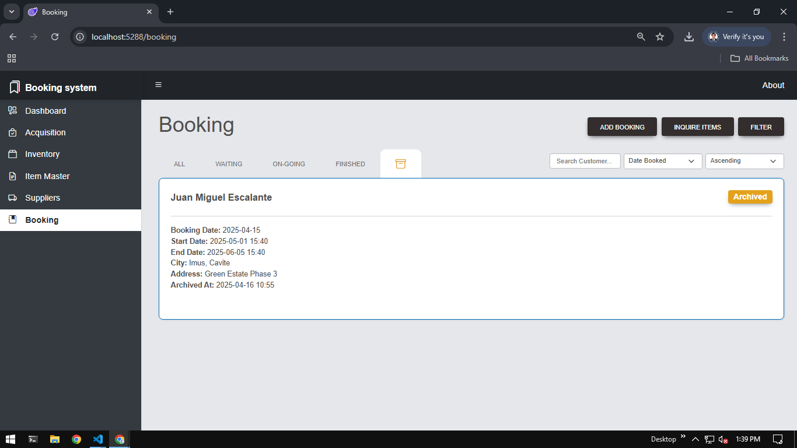

# Booking and Inventory Management System

A web application built with the .NET Framework. Features include Item Master, Supplier Master, inventory tracking, and basic booking management.

## Features

- Item Master Management
- Supplier Master Management
- Item Acquisition
- Inventory Management
- Sorting Feature
- Booking System
- Receipt Generation (PDF Format)

## Item Master

Tablular data of Item Master

### Create Item Master

To create Item Master insert required fields
- Name
- Description
- Unit Of Measurment

### Create Custom Unit of Measurement for Item Master

To create a Custom UoM insert required fields
- Code of Unit of Measurement
- Name
- Base Quantity

The Custom UoM was Created for flexible measurment options regarding stored Items

## Supplier Master

Tablular data of Supplier Master

### Create Supplier Master

To create Supplier Master insert required fields
- Name
- Cont. No
- Address
- Email
- Industry

There are a lot more of important data that is needed but from the Supplier, but for the purpose of simplicity, only the most important data is included.

## Item Acquisition

Tablular data of Item Acquisition

This function is made for acquiring a new item and setting up for booking

### Create Item Acquisition process

To create Item Acquisition insert required fields
*POrder No. is automatically generated by the backend*

**Acquisition Header**
- Supplier Code
- Order date or Acquisition date

**Acquisition Details**
- ItemCode
- *Description is AutoFilled*
- *UoM is AutoFilled*
- Item price (Amount)
- Item Quantity (Qty)

**Check Box Function**  
*The default state (unchecked) when submit button is pressed items will be added as a bundle 
and when checked item will be added as an individual item not belonging to a group and can be
booked as a single item*

There are a lot more of important data that is needed but from the Supplier, but for the purpose of simplicity, only the most important data is included.

### Item Acquisition Selected Function

Tablular data of Item Acquisition when OrderNo. is selected, related details will be displayed

## Inventory

Tablular data of Items in the Inventory, each added item will reflect their added option as an *Individual Item* or on a *Bundle*, *Status* will also be reflected , as well as connected *Booking schedules*

## Booking System

Booking details are displayed in a card. Clicking the card reveals the list of items booked by the customer. 
*Booking state includes: Waiting, On-Going, Finished, Archived, and Canceled*

### Filter/Sort function

Booking details can be filtered or sort to the desired
- Customer Name
- Specific Date of booking
- Order-Based Sorting

**Filter Button** 
*Pressing the Filter button will open an additional sorting function to be able to sort more specific bookings*
- Date Range Sort

### Booking Creation

A Booking Appointment can be made by inserting the Following data in the fields

**Booking Header** 
Holds all of the important details for the customer identification and booked items.

- *Booking reference is automatically generated by the backend*
- Date of booking
- Date and time of the actual use of an Item
- end Date and end time of the booking
- Customer Name
- Location
- Specific delivery address
 
*note: status is default waiting but can be set to on-going for certain circumstances.*

**Booking Details** 
Connected to its header it holds the items that will be booked on a specific date range.

- InventoryCode
- *Description is Autofill*
- *Quantity is Autofill*

### Inquire function

A pop up to quickly see if an item is available or unavailable to be booked, also has a sorting for both available and unavailable.

**Unsorted Items**

**Available Items**

**Unavailable Items**

### Archive function

When the booking is finished the ability to trasfer it to the Archive storage will be available Pressing the Archive button will initiate the action.
*Booking state includes: Waiting, On-Going, Finished, Archived, and Canceled.*

**Archive Storage**

